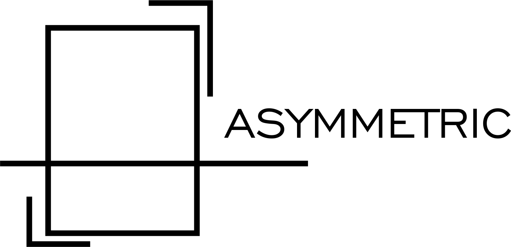

<br>
Projeto da disciplina Engenharia de Software.
O projeto será um sistema web de vendas de obra de arte. 
Nele, terão os tipos de acesso gerente e cliente.
O gerente poderá adicionar, alterar, excluir e consular as obras expostas
O cliente poderá comprar uma ou mais obras e terá um perfil, o qual poderá alterar e excluir.


## Tecnologias Utilizadas
- HTML5 e CSS3
- PHP versão 7.3.5
- Apache2 versão 2.4.29
- MySQL versão 5.7.27

## Padrões de Git
-Todo commit deve conter uma mensagem simples e sucinta
-Todo Pull request deve fechar uma issue
-Todo desenvolvimento deve ser feito em sua branch apropriada

## Regras de Pastas
-Arquivos de desenvolvimento devem ficar separados em pastas com nome de seus segmentos.(Ex: Front-end, Back-end)
-Os arquivos de desenvolvimento devem ficar em suas respectivas pastas de acordo com sua extensão.(Ex:HTML , PHP)
-Arquivos extras do Front-end devem ficar na pasta Assets.
-A documentação ficará na pasta docs.

## Diretórios
```sh
|-- docs
	|-- logos
	|-- Protótipo
	|-- Documento de Requisitos
	|-- Diagramas de Sequencia
	|-- Diagrama de Classe
	|-- Diagrama de Implantação
|-- back-end
	|-- View
	|-- Controller
	|-- Model
	|-- Persistence
	|-- Uploads
		|-- Obras
		|-- Cliente
|-- front-end
	|-- HTML
	|-- CSS
	|-- Assets
|-- integrado
	|-- View
		|-- CSS	
		|-- Assets
	|-- Controller
	|-- Model
	|-- Persistence
	|-- Uploads
		|-- Obras
		|-- Cliente
|-- Padrões adotados
